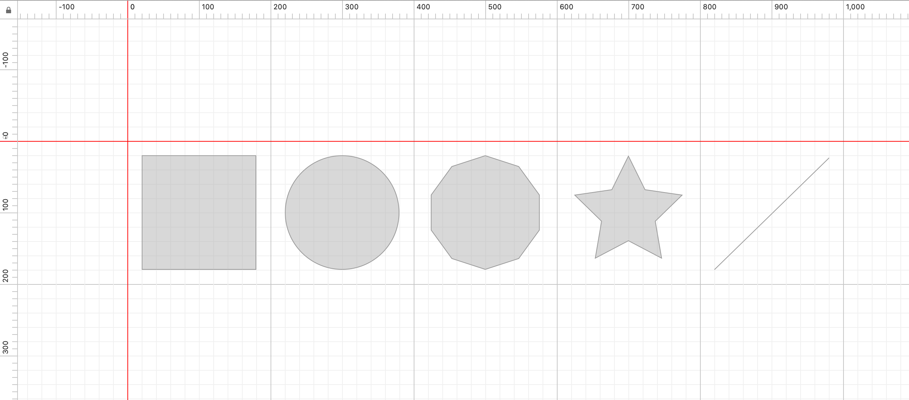
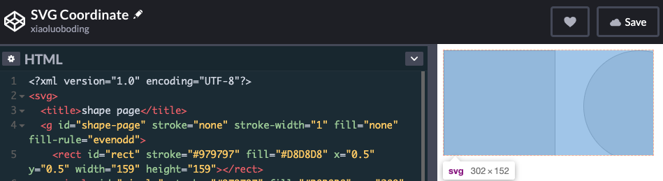
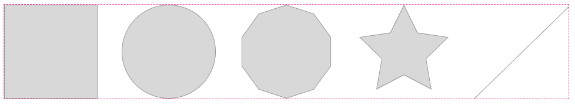
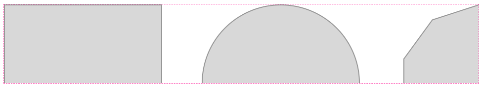
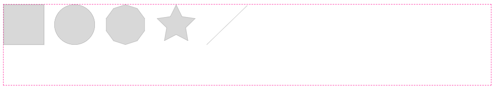

# 📋 SVG 基本介绍

## SVG (Scalable Vector Graphics)

如今可缩放的矢量图（SVG）在 Web 页面上充当着重要的角色，SVG 图标、SVG 图像、SVG 图案、SVG 动画甚至是复杂的数据可视化图表都可以由 SVG 进行绘制。

SVG 特性：

- Responsive

    由于 SVG 是矢量图像，可以无限缩放图像内容而不失真，这样在任何终端看到的图像都是高清的；

- Performance

    SVG 可以进行优化，通过减少不必要的属性或者路径中的点或图形，让文件尺寸更小；

- Interactive

    SVG 代码是 XML 语言进行描述的，可以结合 CSS 以及 JavaScript 进行交互；

- Designable

    业界有非常强大的设计工具可以将设计好的 SVG 图像输出为 SVG 代码，比如 Adobe Illustrator、Sketch、InkScape 等。SVG 拥有对设计师和开发者都友好的内容输出；

- Visualization

    通过结合数据，SVG 也可以实现复杂的数据可视化图表，比如: ECharts SVG Version / D3.js 都是使用 SVG 进行图表绘制。

## SVG 基本图形

```xml
<?xml version="1.0" encoding="UTF-8"?>
<svg width="960px" height="160px" viewBox="0 0 960 160" version="1.1" xmlns="http://www.w3.org/2000/svg" xmlns:xlink="http://www.w3.org/1999/xlink">
  <title>shape page</title>
  <g id="shape-page" stroke="none" stroke-width="1" fill="none" fill-rule="evenodd">
    <rect id="rect" stroke="#979797" fill="#D8D8D8" x="0.5" y="0.5" width="159" height="159"></rect>
    <circle id="circle" stroke="#979797" fill="#D8D8D8" cx="280" cy="80" r="79.5"></circle>
    <path d="M480,0.525731112 L433.286197,15.7039659 L404.415479,55.4411003 L404.415479,104.5589 L433.286197,144.296034 L480,159.474269 L526.713803,144.296034 L555.584521,104.5589 L555.584521,55.4411003 L526.713803,15.7039659 L480,0.525731112 Z" id="decagon" stroke="#979797" fill="#D8D8D8"></path>
    <path d="M680,1.12977573 L656.820623,48.0963241 L604.989959,55.6277604 L642.49498,92.1861198 L633.641245,143.807352 L680,119.435112 L726.358755,143.807352 L717.50502,92.1861198 L755.010041,55.6277604 L703.179377,48.0963241 L680,1.12977573 Z" id="star" stroke="#979797" fill="#D8D8D8"></path>
    <line x1="800.5" y1="159.5" x2="960" y2="4" id="line" stroke="#979797" stroke-linecap="square"></line>
  </g>
</svg>
```

上面代码会绘制出以下图形



可以下 CodePen 上进行尝试 👇

<EmbedCodepen title="SVG shapes" pen="wvKNQxb" :height="256" />

[SVG 基本图形](https://developer.mozilla.org/zh-CN/docs/Web/SVG/Tutorial/Basic_Shapes) 包括：

* rect - 矩形
* circle - 圆形
* ellipse - 椭圆
* line - 线条
* polyline - 折线
* polygon - 多边形
* path - 路径

## SVG 坐标系统

以下例子都是基于上面基本图形的 SVG 代码，基本图形定义如下：

- `viewport` 为 960px * 160px
- `viewBox` 为 0, 0, 960 160

我们知道 5 个图形是在长 960px、宽 160px 的矩形区域内的。

### viewport

SVG 的视口范围（viewport）由 `width`、`height` 属性声明，定义了 SVG 文档的可视宽高，如果 SVG 元素不声明 viewport，则浏览器默认给定宽高为 300px * 150px。



viewport = 300px * 150px

### viewbox

SVG 元素的 `viewBox` 是个强大的属性，它定义了 SVG 真正意义上具有可缩放的特性，viewBox 的属性由四个属性组成 `<min-x>`、`<min-y>`、`width`、`height`，不难看出，这四个属性就和坐标系、以及可视区域的宽高有关系。`<min-x>、<min-y>` 决定了 SVG 在坐标系中的位置，`width、height` 决定了 viewBox 的宽高。从而形成一个可见的矩形区域。

实际上，当 SVG 元素不声明 viewBox 属性时，SVG 的可视范围就是 `viewport` 大小。

```js
<svg width="960px" height="160px">
  <title>shape page</title>
  <g id="shape-page" stroke="none" stroke-width="1" fill="none" fill-rule="evenodd">
    <!-- some shapes -->
  </g>
</svg>
```



### viewport 等于 viewbox 时

当初始化 viewBox 的坐标系为 `0 0` 并且宽高声明等于 viewport 时，等同于没有设置 viewBox。显示效果是一样的。

```js
<svg width="960px" height="160px" viewBox="0 0 960 160">
  <title>shape page</title>
  <g id="shape-page" stroke="none" stroke-width="1" fill="none" fill-rule="evenodd">
    <!-- some shapes -->
  </g>
</svg>
```


### viewport 大于 viewbox 时，SVG 放大了

假设 viewBox 设定为 viewport 的一半时

```js
<svg width="960px" height="160px" viewBox="0 0 480 80">
  <title>shape page</title>
  <g id="shape-page" stroke="none" stroke-width="1" fill="none" fill-rule="evenodd">
    <!-- some shapes -->
  </g>
</svg>
```



### viewport 小于 viewbox 时，SVG 缩小了

假设 viewBox 设定为 viewport 的2倍时

```js
<svg width="960px" height="160px" viewBox="0 0 1920 160">
  <title>shape page</title>
  <g id="shape-page" stroke="none" stroke-width="1" fill="none" fill-rule="evenodd">
    <!-- some shapes -->
  </g>
</svg>
```



### 深入了解 SVG坐标系统

Sara Soueidan 写过一个系列，[Understanding SVG Coordinate Systems and Transformations](https://www.sarasoueidan.com/blog/svg-coordinate-systems/) 有兴趣的童鞋，建议完整阅读下。

还有一个非常棒的在线例子，帮助你了解 SVG 坐标系统

[SVG Coordinate Systems & Transformations (Part 1)](https://www.sarasoueidan.com/demos/interactive-svg-coordinate-system/index.html)

## SVG 动画

### SMIL 或者 CSS 还是 JavaScript?

| 技术  | 描述           | 备注  |
| :---: |:-------------| :-----:|
| SMIL    | SMIL 标准即将废弃，尽量不要使用 | Chrome 45以后弃用了SMIL |
| CSS    | CSS 还只能实现简单的动画 | - |
| JavaScript    | 复杂动画就要用到 JS了 | - |

### 可以实现什么类型的 SVG 动画?

* Transform（scale、rotate、translate 、skew）
* 路径动画 （path）
* 描边动画（stroke）
* 形状变化（Morphing)
* 蒙版动画（Mask）
* 颜色控制（color / background-color / opacity)

### 优秀的 SVG 类库

| 类库  | 描述           |
| :---: |:-------------|
| GSAP   | Sarah Drasner Recommend, The best one. |
| Snap.svg    | The  "jQuery" of SVG |
| Velocity.js    | Velocity offers a lot of the sequencing that GreenSock does, but without a lot of the bells and whistles |
| React-Motion    | React TechStack |
| Vivus.js    | Vivus is a lightweight JavaScript class (with no dependencies) that allows you to animate SVGs, giving them the appearence of being drawn |
| anime.js    | Anime.js (/ˈæn.ə.meɪ/) is a lightweight JavaScript animation library with a simple, yet powerful API. It works with CSS properties, SVG, DOM attributes and JavaScript Objects. |
| SVG.js    | The lightweight library for manipulating and animating SVG. |
| d3.js    | Bring data to life with SVG, Canvas and HTML. |
| Sprite.js    | SpriteJS 是跨平台的高性能图形系统，它能够支持web、node、桌面应用和小程序的图形绘制和实现各种动画效果。 |

此小册动画实战系列采用 `GSAP` 进行动画开发。OK，也许你奇怪为什么偏偏选择了GSAP，后续章节会进行介绍，[《🪀 使用 GreenSock 制作动画 》](./chapter4.md)

## 参考

- [https://developer.mozilla.org/zh-CN/docs/Web/SVG/Tutorial](https://developer.mozilla.org/zh-CN/docs/Web/SVG/Tutorial)
- [https://www.sarasoueidan.com/blog/svg-coordinate-systems/](https://www.sarasoueidan.com/blog/svg-coordinate-systems/)