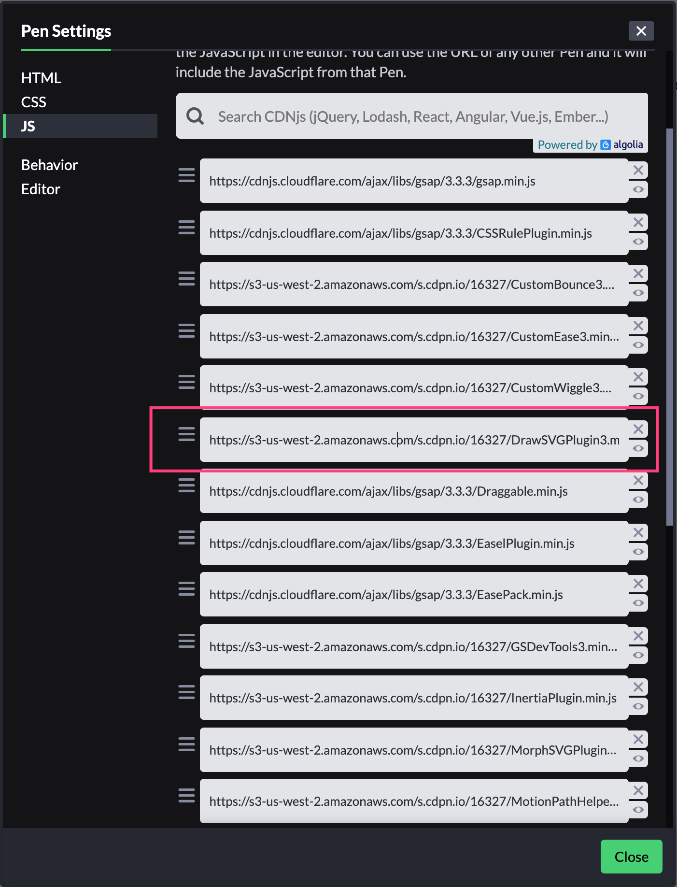

# 🤟 Vue + GSAP 实战

在学习过基础 SVG 动画原理后，如果结合我们熟悉的技术栈使用岂不是更爽。`GSAP` 提供了 npm 安装包，下面我们来在 `Vue` 项目中集成 GSAP。

## 安装 GSAP

```bash
yarn add gsap -S
// or
npm i gsap -S
```

## 在 Vue 组件中使用 GSAP

假设我们让一个矩形旋转 240 度，无限循环。

```html
<template>
  <div id="app" class="app">
    <div class="box"></div>
  </div>
</template>

<script>
import { gsap } from 'gsap'

export default {
  name: 'App',
  mounted() {
    gsap.to('.box', {
      rotation: 240,
      repeat: -1
    })
  }
}
</script>

<style>
.box {
  padding: 0.25rem;
  background: lightgreen;
  width: 3rem;
  height: 3rem;
  margin-right: 0.25rem;
}
</style>
```

## 项目演示

<iframe src="https://codesandbox.io/embed/vue-gsap-demo1-o75xd?fontsize=14&hidenavigation=1&theme=dark&view=preview"
  style="width:100%; height:500px; border:0; border-radius: 4px; overflow:hidden;"
  title="Vue + GSAP Demo1"
  allow="accelerometer; ambient-light-sensor; camera; encrypted-media; geolocation; gyroscope; hid; microphone; midi; payment; usb; vr; xr-spatial-tracking"
  sandbox="allow-forms allow-modals allow-popups allow-presentation allow-same-origin allow-scripts"
></iframe>

## 付费功能

使用 `npm` 安装的 `gsap` 类库中，部分高级功能是需要加入 GreenSock Club （付费）才能使用的。比如之前介绍过的，描边动画会用到的 `DrawSVG` 、变形动画会用到 `MorphSVG` 等，这些只有加入 club ，成为会员才有使用权。不过 GreenSock 仍然提供了免费的试用版本。


## 如何在项目中使用付费功能？

::: tip
💡 免费试用版本付费插件使用的是在线 CDN
:::

聪明的你可能想到了。既然提供了免费的试用版本 CDN，那么 CDN 资源我们是能获取到的。比如我们使用 Vue 完成一个 [SVG 描边动画](https://www.notion.so/svganimation/SVG-Stroke-f3f8741b236849fe8dd1707579cd2e5f) 例子 Hi There。

### 获取 CDN

在 GreenSock 提供的 [CodePen Demos](https://codepen.io/GreenSock/pen/aYYOdN) 中，我们可以免费体验 GreenSock Club 中的插件功能。查看 CodePen 使用的 JS 资源，会发现 `DrawSVGPlugin` 的身影，这个资源不是一个公开的放在 `cloudflare` CDN 服务地址上的资源，像是上传到 CodePen 上的资源。我们可以打开这个 JS 链接，Copy 代码放在本地。



### 引入 DrawSVGPlugin

```jsx
import { gsap } from 'gsap'
import DrawSVGPlugin from '@/plugins/DrawSVGPlugin'

gsap.registerPlugin(DrawSVGPlugin)
```

### 项目样例

<iframe src="https://codesandbox.io/embed/vue-gsap-hi-there-demo-pridr?fontsize=14&hidenavigation=1&theme=dark&view=preview"
  style="width:100%; height:500px; border:0; border-radius: 4px; overflow:hidden;"
  title="Vue + GSAP Hi There Demo"
  allow="accelerometer; ambient-light-sensor; camera; encrypted-media; geolocation; gyroscope; hid; microphone; midi; payment; usb; vr; xr-spatial-tracking"
  sandbox="allow-forms allow-modals allow-popups allow-presentation allow-same-origin allow-scripts"
></iframe>

OK，到这我们也可以在 Vue 中使用付费的插件了。但是，这种方法仍然是一个**投机取巧**的方法。我们得不到 GreenSock 的功能更新，因为付费插件没有集成在 GSAP 类库中。

当 GSAP 升级了插件，我们只能再去获取新的插件 CDN，不过作为个人练手项目，或者本地使用的项目。这到是个不错的方法。使用其他付费插件同理。

::: warning
⚠️ 不建议在公开的项目中使用 GreenSock 付费插件，毕竟涉及版权问题。
:::

---

## 🙏 感谢

感谢你阅读到了这里，到此本小册内容就完结了。希望小册内容能让你对 SVG 有一个简单的了解。对 SVG 动画的表现形式有初步的概念。甚至能自己动手去实现你的动画 idea 又或者能把动画技术运用到项目中。

最后推荐一本书给大家，[Sarah Drasner](https://twitter.com/sarah_edo) 的 [《SVG Animations》](https://www.oreilly.com/library/view/svg-animations/9781491939697/)，是这本书给予我关于本小册的很多有用的知识点。Sarah 是一个活跃于开源社区的程序媛，屡次获奖的线下 CONF 演讲者，Vue 开源项目的核心成员，Netlify 的 Tech Leader。她的这本书以及在 CSS Tricks 上的文章确实让我学到不少有趣的知识。

> — — — 2020.06.17
