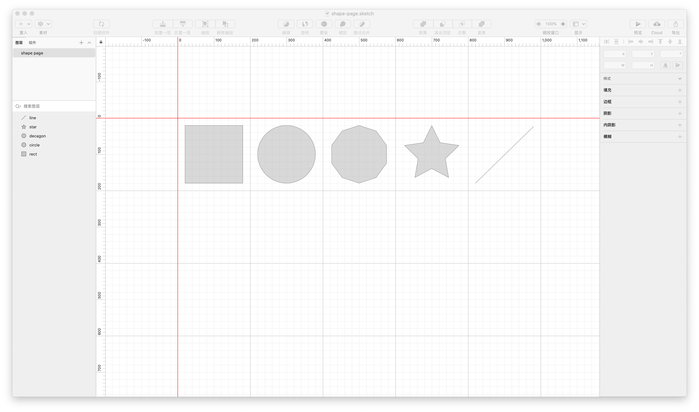
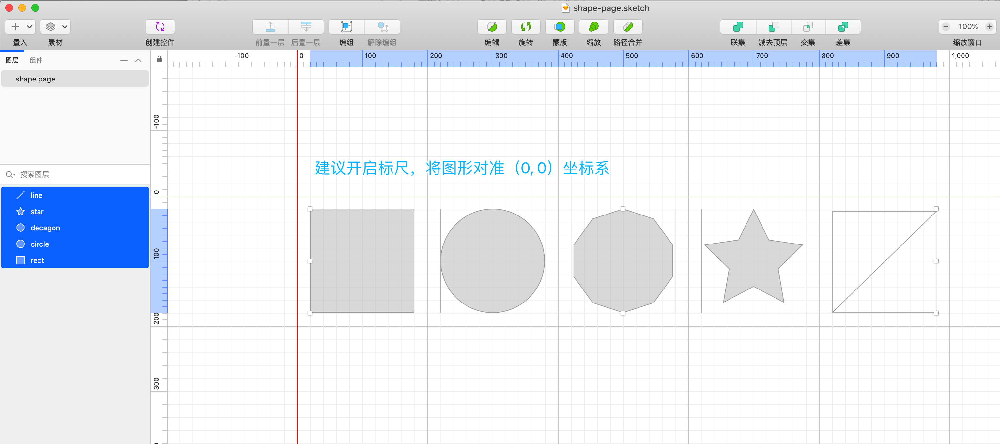
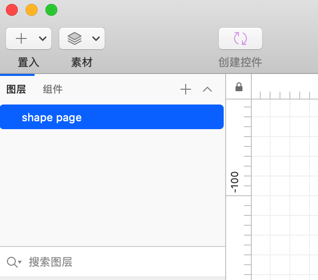
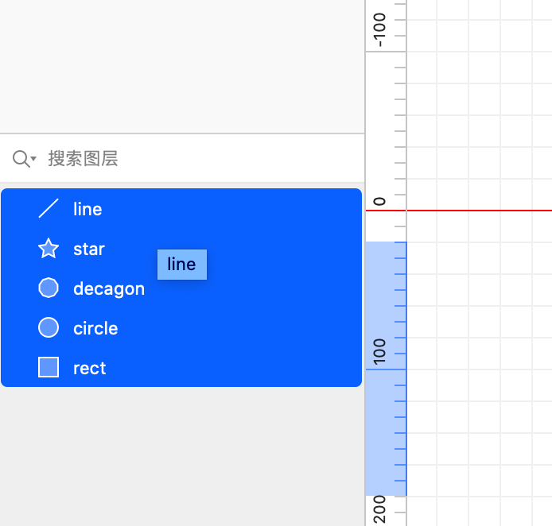
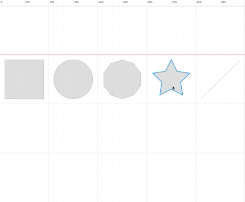
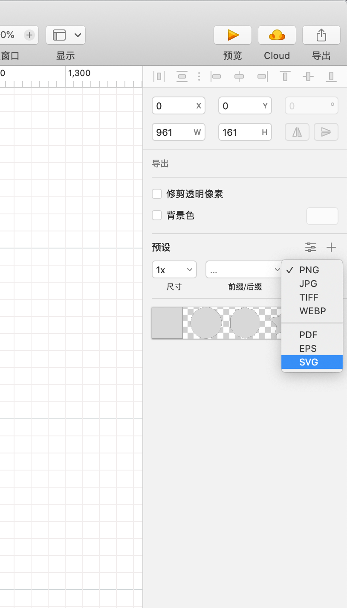
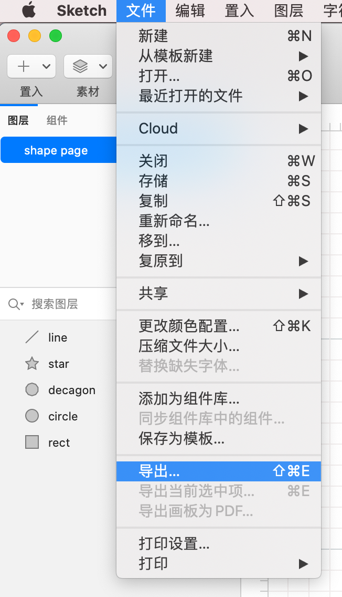

# 📃 SVG 文件输出

在编写 SVG 动画前，我们应该先要准备矢量文件，矢量文件包含来我们需要的 SVG 代码，通常我们不会去手写 SVG 代码，简单的形状还过得去，复杂点的形状，手写代码会变得吃力很多，我们可以借助诸如 Adobe Illustrator（简称AI）、Sketch 或者是 Inkscape 这样的专业的矢量设计工具来进行矢量图形设计，然后导出 SVG 代码。

下面我们主要介绍使用 `Sketch` 来输出 SVG 文件

## Sketch 输出 SVG

::: tip
💡 Sketch Tips
:::

Sketch 是 macOS 上的 UI 设计利器，支持完善的 SVG 图形编辑功能。上节[《SVG 基本介绍》](chapter1.md) 中的图形代码就是通过 `Sketch` 生成的。下面我们来认识下跟开发息息相关的一些操作，再来看一下上小节的图形代码以及 Sketch 界面：

```xml
<?xml version="1.0" encoding="UTF-8"?>
<svg width="960px" height="160px" viewBox="0 0 960 160" version="1.1" xmlns="http://www.w3.org/2000/svg" xmlns:xlink="http://www.w3.org/1999/xlink">
  <title>shape page</title>
  <g id="shape-page" stroke="none" stroke-width="1" fill="none" fill-rule="evenodd">
    <rect id="rect" stroke="#979797" fill="#D8D8D8" x="0.5" y="0.5" width="159" height="159"></rect>
    <circle id="circle" stroke="#979797" fill="#D8D8D8" cx="280" cy="80" r="79.5"></circle>
    <path id="decagon" d="M480,0.525731112 L433.286197,15.7039659 L404.415479,55.4411003 L404.415479,104.5589 L433.286197,144.296034 L480,159.474269 L526.713803,144.296034 L555.584521,104.5589 L555.584521,55.4411003 L526.713803,15.7039659 L480,0.525731112 Z" stroke="#979797" fill="#D8D8D8"></path>
    <path id="star" d="M680,1.12977573 L656.820623,48.0963241 L604.989959,55.6277604 L642.49498,92.1861198 L633.641245,143.807352 L680,119.435112 L726.358755,143.807352 L717.50502,92.1861198 L755.010041,55.6277604 L703.179377,48.0963241 L680,1.12977573 Z" stroke="#979797" fill="#D8D8D8"></path>
    <line id="line" x1="800.5" y1="159.5" x2="960" y2="4" stroke="#979797" stroke-linecap="square"></line>
  </g>
</svg>
```



## 坐标系

::: tip
💡 开启 Sketch 的标尺功能有助于我们找准 （0, 0）坐标系
:::

导出为 SVG 代码时，我们可以看到 `viewBox` 属性代表了整张画布承载图像内容视口



```xml
<svg width="960px" height="160px" viewBox="0 0 960 160" version="1.1" xmlns="http://www.w3.org/2000/svg" xmlns:xlink="http://www.w3.org/1999/xlink">
  ...
</svg>
```

## 命名图层

::: tip
💡 建议给图层命名，导出代码对应 SVG 中的 `g` 标签，`g` 代表 group（分组） 的意思
:::

给图层命名后，多个图层（分组）之间容易分辨，上面例子我们给图层命名为 `shape page` ，代码中 `g` 标签的 `id` 属性就是图层的名字，Sketch 自动加上了 **"-"**.



## 命名图形

::: tip
💡 建议给图形命名，导出代码时对应 SVG 中的基本图形
:::

同图层，代码中图形的 `id` 属性即为我们给图形命名的名称，上例我们给图形命名分别是：`line`、`star`、`decagon`、`circle`、`rect` ，这样区分开每个图形代码。



## 拷贝 SVG 代码

在 Sketch 中拷贝 SVG 代码很简单，只需在我们想导出的内容上右键，即可找到 “拷贝 SVG 代码” 功能项。

比如导出图形 star，选中 star，右键拷贝 SVG 代码：



代码如下，这时图层 `shape page` 只包含了一个图形：

```xml
<?xml version="1.0" encoding="UTF-8"?>
<svg width="154px" height="145px" viewBox="0 0 154 145" version="1.1" xmlns="http://www.w3.org/2000/svg" xmlns:xlink="http://www.w3.org/1999/xlink">
  <title>star</title>
  <g id="shape-page" stroke="none" stroke-width="1" fill="none" fill-rule="evenodd">
    <path d="M77,1.12977573 L53.8206227,48.0963241 L1.98995927,55.6277604 L39.4949796,92.1861198 L30.6412453,143.807352 L77,119.435112 L123.358755,143.807352 L114.50502,92.1861198 L152.010041,55.6277604 L100.179377,48.0963241 L77,1.12977573 Z" id="star" stroke="#979797" fill="#D8D8D8"></path>
  </g>
</svg>
```

## 导出 SVG

导出 SVG 文件，不同于拷贝 SVG 代码，需要两步：

`预设 → SVG`



`文件 → 导出`



Sketch 会导出一个 SVG 文件，用编辑器打开 SVG 文件就得到我们想要的代码。

---

Sketch 输出 SVG 图像的简单介绍就到这里，Sketch 除了可以创建 SVG 图形，也可以编辑 SVG，我们可以将网络上获取的 SVG 文件进行编辑，得到自己想要的 SVG 图像。更强大的功能是 path (路径)，我们可以自己画出想要的图形，输出为 SVG 代码，进行动画开发。

## 📎 附件

[shape-page.sketch](https://github.com/xiaoluoboding/svg-animation-booklet/blob/main/docs/public/shape-page.sketch)

这里下载 `shape page` 的 Sketch 版本

实际开发中，开发者用到的 SVG 文件有一些属性声明是不必要的，我们需要借助工具减少 SVG 文件的体积大小。参见下一章节。
