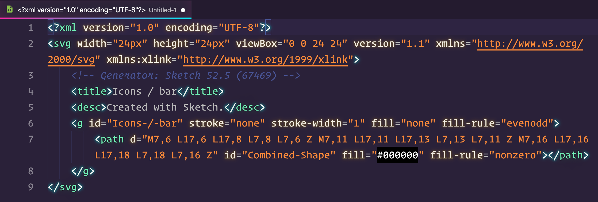
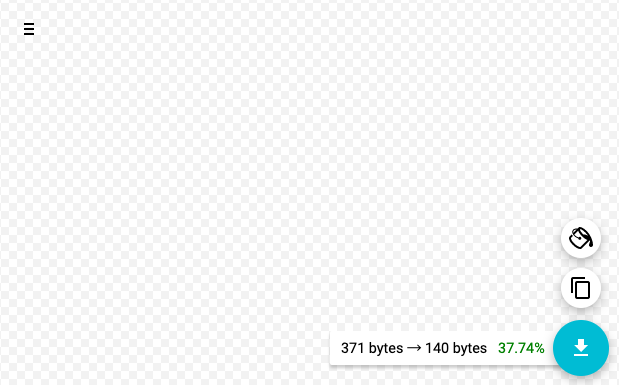
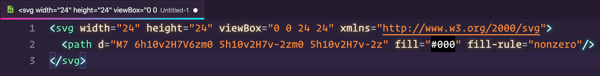
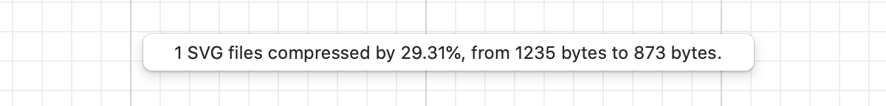

# 🚀 SVG 文件优化

一般我们使用 AI、Sketch 等矢量图设计工具导出的 SVG 文件代码相对还是比较“臃肿”的，实际在 Web 页面上使用 SVG 时候，有些标签或者属性是不需要的。比如 `title` / `desc` 标签、或者`version` 属性声明。

我们可以借助优化工具来简化 SVG 文件大小，并且保持 SVG 原有输出的矢量内容。

## 工具

SVG 的优化常用手段是使用工具 [svgo](https://github.com/svg/svgo) ，svgo 是一个运行在 Node.js 下的优化 SVG 文件的命令行工具。我们也可以使用基于 svgo 而衍生的一些工具，比如：

- Web 应用： [SVGOMG](https://jakearchibald.github.io/svgomg/)
- Sketch 插件： [svgo-compressor](https://www.sketch.com/extensions/plugins/svgo-compressor/)
- 张鑫旭开发的小工具： [SVG在线压缩合并工具](https://www.zhangxinxu.com/sp/svgo/)

## Web 应用优化

### 优化前

比如下面是设计师童鞋使用 Sketch 输出的一个 Icon。代码如下：



### 优化后

下面使用 `SVGOMG` 工具进行优化，可以看到优化后的文件仅仅占有源文件的 **37.74%** 体积大小



再看下优化后的 SVG 代码文件



一些无用的标签以及属性已经去掉了，保持了 SVG 文件的简洁性，svgo 提供了一些列可配置的选项，方便控制哪些属性/标签会被移除。

## Sketch 输出优化

如果开发者是和 UI 童鞋合作的化，建议把 Sketch 插件  [svgo-compressor](https://www.sketch.com/extensions/plugins/svgo-compressor/)  推荐给 UI 童鞋，这样我们拿到的 SVG 文件就是优化过后的了。

### 优化前

如上一章节，无论是`拷贝 SVG 代码`还是`导出 SVG 文件`，优化前的图形代码如下：

```xml
<?xml version="1.0" encoding="UTF-8"?>
<svg width="960px" height="160px" viewBox="0 0 960 160" version="1.1" xmlns="http://www.w3.org/2000/svg" xmlns:xlink="http://www.w3.org/1999/xlink">
  <title>shape page</title>
  <g id="shape-page" stroke="none" stroke-width="1" fill="none" fill-rule="evenodd">
    <rect id="rect" stroke="#979797" fill="#D8D8D8" x="0.5" y="0.5" width="159" height="159"></rect>
    <circle id="circle" stroke="#979797" fill="#D8D8D8" cx="280" cy="80" r="79.5"></circle>
    <path d="M480,0.525731112 L433.286197,15.7039659 L404.415479,55.4411003 L404.415479,104.5589 L433.286197,144.296034 L480,159.474269 L526.713803,144.296034 L555.584521,104.5589 L555.584521,55.4411003 L526.713803,15.7039659 L480,0.525731112 Z" id="decagon" stroke="#979797" fill="#D8D8D8"></path>
    <path d="M680,1.12977573 L656.820623,48.0963241 L604.989959,55.6277604 L642.49498,92.1861198 L633.641245,143.807352 L680,119.435112 L726.358755,143.807352 L717.50502,92.1861198 L755.010041,55.6277604 L703.179377,48.0963241 L680,1.12977573 Z" id="star" stroke="#979797" fill="#D8D8D8"></path>
    <line x1="800.5" y1="159.5" x2="960" y2="4" id="line" stroke="#979797" stroke-linecap="square"></line>
  </g>
</svg>
```

### 优化后

SVGO Compressor 只适用于`导出 SVG 文件` ，`拷贝 SVG 代码`是不能被压缩的，使用插件导出后，会有一行类似的提示：`1 SVG files compressed by 29.31%, from 1234 bytes to 873 bytes.`



再来看下我们优化后的代码

```xml
<svg xmlns="http://www.w3.org/2000/svg" width="666" height="102" viewBox="0 0 666 102">
  <g fill="none" fill-rule="evenodd">
    <path fill="#FFF" stroke="#000" stroke-width="2" d="M497.833333,5.28389709 L483.271369,35.1844928 L450.677268,39.9840706 L474.26363,63.2827467 L468.699074,96.160745 L497.833333,80.6389961 L526.967592,96.160745 L521.403037,63.2827467 L544.989398,39.9840706 L512.395298,35.1844928 L497.833333,5.28389709 Z"/>
    <path fill="#FFF" stroke="#000" stroke-linejoin="round" stroke-width="2" d="M347.763441,1 L378.565457,11 L397.602151,35.5491503 L397.602151,66.757608 L378.565457,91.4508497 C365.556718,97.8169499 355.289379,101 347.763441,101 C340.237503,101 329.970164,97.8169499 316.961424,91.4508497 L297.924731,66.757608 L297.924731,35.5491503 L316.961424,11 L347.763441,1 Z"/>
    <rect width="97.677" height="98" x="1" y="2" fill="#FFF" stroke="#000" stroke-width="2"/>
    <circle cx="199.516" cy="51" r="49" stroke="#000" stroke-width="2"/>
    <line x1="576.163" x2="664.267" y1="90.753" y2="12.247" stroke="#000" stroke-linecap="square" stroke-width="2"/>
  </g>
</svg>
```

## 插件下载

去官网下载最新版：[SVGO Compressor For Sketch](https://www.sketch.com/extensions/plugins/svgo-compressor/)
