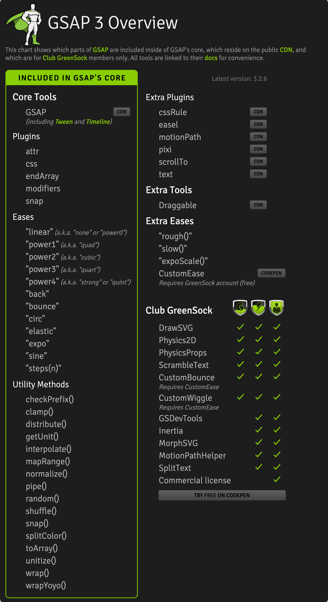

# 🪀 使用 GreenSock 制作动画

## 为什么选择 GSAP？

先来看一个 GSAP （GreenSock Animation Platform）介绍，以下动画使用 GSAP 编写：

[https://codepen.io/GreenSock/pen/yhEmn](https://codepen.io/GreenSock/pen/yhEmn)


确实如今有很多种方法让 Web 页面生动起来，我在《SVG 基本介绍》章节也对比过一些优秀的 SVG 相关类库，为什么我选择使用 GSAP 编写 SVG 动画，我们看一张 GSAP 功能全景图



相比之下 GSAP 有以下优点：

- 几乎可以让任何元素动起来，包括 SVG
- 语法简洁，容易上手
- 拥有操作时间轴功能，对制作线性动画有很大帮助
- 样例丰富，在 CodePen 上有大量 Demo
- 插件功能强大，包括 DrawSVG、MorphSVG 等
- 性能良好，兼容性良好

GSAP 到底有什么用呢，其实 GSAP 的核心功能是提供了操纵元素属性的能力，更有功能强大的插件辅助，会让复杂动画变的可操控。

## 开始使用 GSAP

> 下面使用一个小例子讲解 GSAP

### 准备 SVG

我们在 Sketch 里绘制了一个圆形，导出优化后的 SVG 代码如下：

```html
<svg width="960px" height="240px" viewBox="0 0 960 240">
  <g id="shape-page">
    <circle id="circle" fill="#60CCFD" cx="120" cy="120" r="80"></circle>
  </g>
</svg>
```

### 简单位移

```jsx
// 描述了使目标 circle 在两秒内向 x 轴位移 320px
gsap.to('#circle', {
  x: 320,
  duration: 2
})
```

<EmbedCodepen title="GSAP Circle Animation 1" pen="LYpKqbm" />

如果你也熟悉使用 CSS 开发动画，那么下面列表会帮助你理解 `[gsap.to](http://gsap.to)` 中属性的作用

```jsx
x: 100 // transform: translateX(100px)
y: 100 // transform: translateY(100px)
z: 100 // transform: translateZ(100px)
scale: 2 // transform: scale(2)
scaleX: 2 // transform: scaleX(2)
scaleY: 2 // transform: scaleY(2)
scaleZ: 2 // transform: scaleZ(2)
skew: 15 // transform: skew(15deg)
skewX: 15 // transform: skewX(15deg)
skewY: 15 // transform: skewY(15deg)
rotation: 180 // transform: rotate(180deg)
rotationX: 180 // transform: rotateX(180deg)
rotationY: 180 // transform: rotateY(180deg)
rotationZ: 180 // transform: rotateZ(180deg)
perspective: 1000 // transform: perspective(1000px)
transformOrigin: '50% 50%' // transform-origin: 50% 50%
```

是不是看起来像是 `CSS transform` 属性的简写，没错，很容易上手使用对不对。

### 缓动动画

GSAP 提供了内置的缓动函数，默认 `ease` 属性值为: `'power1.out'` ，比如我们让 circle 像球一样弹起运动。只需设定属性 `ease: 'bounce'` 

<EmbedCodepen title="GSAP Circle Animation 2" pen="YzyoBgb" />

GSAP 还支持这些缓动函数： [https://greensock.com/ease-visualizer/](https://greensock.com/ease-visualizer/)

### 时间轴线

`gsap.timeline()` 是 GSAP 提供的另一个神器，拥有操纵时间轴线的能力，会让动画有序进行，在我们需要控制一组动画的时候非常有用

比如让多个 circle 有序移动：

<EmbedCodepen title="GSAP Circle Animation 3" pen="zYvVbYL" />

### 时间控制

`gsap.timeline` 提供了第三个参数，这个参数可以让动画运行时间变得可控，让动画变得更生动有趣。

下面例子时间轴动画时长为 `duration: 0.66` ，下面让第 2、3、4 个 circle 使用相对时间，减去动画时长，那么制造了多个 circle 一同运动的效果。

<EmbedCodepen title="GSAP Circle Animation 4" pen="gOaNEwr" />

### 时间交错

`gsap.to` 提供了一个用于控制时间交错的属性：`stagger` ，这个属性同样是对动画时间的控制，比如让多个 circle 同时以 `0.2s` 的时间错开进行Y轴位移运动

<EmbedCodepen title="GSAP Circle Animation 5" pen="pojXYVK" />

GSAP 的简单使用介绍就到这里，它的功能远不止这些。还有一些强大的插件，能写出更复杂、更有意思的动画效果。等你去尝试。

## GSAP Tools

GreenSock Animation Platform 提供了一些优秀的助手/调试工具，有助于我们在开发动画时候进行调试。这些工具有一些需要加入 Club GreenSock 才能使用

[Ease Visualizer](https://greensock.com/ease-visualizer)

[GSDevTools](https://greensock.com/gsdevtools/)

[GSAP Docs](https://greensock.com/docs/v3/Plugins/MotionPathHelper)

## 参考

- [https://greensock.com/get-started/](https://greensock.com/get-started/)
