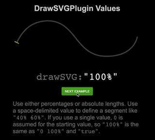
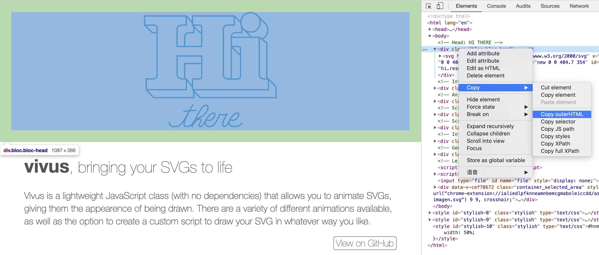

# ✏️ SVG 描边动画（Stroke）

## 演示


查看在线版本

* [Polygon's PlayStation 4 Review](https://www.polygon.com/a/ps4-review/)

* [vivus.js - svg animation](http://maxwellito.github.io/vivus/)

## 原理

要实现上面酷炫的描边动画，首先我们需要了解 SVG 中实现描边动画的三个相关属性：分别是 `stroke`、`stroke-dasharray`、`stroke-dashoffset`。这三个属性作为外观显示属性，都可以作为 CSS 属性来使用。

### stroke

SVG 中的 stroke 属性用来控制绘制描边的方式，我们也可以使用 CSS 来控制 SVG 的描边样式。

<EmbedCodepen title="SVG stroke demo" pen="pojavPr" />

### stroke-dasharray

我们知道在 CSS 中实现虚线边框，要使用 `border: 1px dashed #f4a;` ；在 SVG 中要实现虚线效果就要使用 `stroke-dasharray`  属性。

<EmbedCodepen title="SVG stroke-dasharray demo" pen="YzyePJP" />

### stroke-dashoffset

`stroke-dashoffset` 属性用来指定路径从开始位置的偏移量。通过指定偏移量会让绘制好的线偏移

原来的位置一段空白

<EmbedCodepen title="SVG stroke-dashoffset demo" pen="QWjQwoO" />

### 动起来

那么结合上面三个属性，我们试着动态改变 `stroke-dashoffset` 属性，看看会发生什么。通过动态改变偏移量属性，结合设定好的 `width` 以及 `stroke-dasharray` 属性，会让原来静态的线有一种用画笔描绘出来的效果。

<EmbedCodepen title="SVG stroke animate demo" pen="XWmZJLo" />

## 实战

下面我们使用 `GreenSock` 实现描边效果，GreenSock 提供了 [DrawSVGPlugin](https://greensock.com/docs/v3/Plugins/DrawSVGPlugin) 用于控制各种图形的描边效果，原理主要是通过控制上面学过的 `stroke-dasharray` 、`stroke-dashoffset` 两个CSS属性来实现动画效果。



### 获取 SVG 代码

这里就使用 [vivus](http://maxwellito.github.io/vivus/) 中的 **Hi There 动画** 作为 Demo，打开 vivus 官网，打开开发者工具，这里使用的是 Chrome，选中 **Hi There** dom 元素，可以看到 Hi There 的 SVG 代码。我们选中元素右键复制出来。



得到如下代码：

```html
<div class="bloc bloc-head">
  <svg height="300" xmlns="http://www.w3.org/2000/svg" x="0px" y="0px" viewBox="0 0 404.7 354" enable-background="new 0 0 404.7 354" id="hi-there" onclick="hi.reset().play();">

    <!-- HI -->
    <path data-duration="10" d="M324.6,61.2c16.6,0,29.5-12.9,29.5-29.5c0-16.6-12.9-29.5-29.5-29.5c-16.6,0-29.5,12.9-29.5,29.5C295.1,48.4,308,61.2,324.6,61.2z" style="stroke-dasharray: 186, 226; stroke-dashoffset: 0;"></path>
    <path data-duration="130" d="M366.2,204.2c-9.8,0-15-5.6-15-15.1V77.2h-85v28h19.5c9.8,0,8.5,2.1,8.5,11.6v72.4c0,9.5,0.5,15.1-9.3,15.1H277h-20.7c-8.5,0-14.2-4.1-14.2-12.9V52.4c0-8.5,5.7-12.3,14.2-12.3h18.8v-28h-127v28h18.1c8.5,0,9.9,2.1,9.9,8.9v56.1h-75V53.4c0-11.5,8.6-13.3,17-13.3h11v-28H2.2v28h26c8.5,0,12,2.1,12,7.9v142.2c0,8.5-3.6,13.9-12,13.9h-21v33h122v-33h-11c-8.5,0-17-4.1-17-12.2v-57.8h75v58.4c0,9.1-1.4,11.6-9.9,11.6h-18.1v33h122.9h5.9h102.2v-33H366.2z" style="stroke-dasharray: 2216, 2256; stroke-dashoffset: 0;"></path>

    <path data-async="" data-delay="20" d="M358.8,82.8c11.1-4.2,18.8-14.7,18.8-27.5c0-8.5-3.4-16-8.9-21.3" style="stroke-dasharray: 60, 100; stroke-dashoffset: 0;"></path>
    <path data-async="" d="M124.2,105.7V77c0-11.5,9.1-13.8,17.5-13.8h10.5V44.7" style="stroke-dasharray: 84, 124; stroke-dashoffset: 0;"></path>
    <path data-async="" d="M147.9,40.2L171.2,63.2L175.7,63.2" style="stroke-dasharray: 38, 78; stroke-dashoffset: 0;"></path>
    <path data-async="" d="M295.1,32.1L275.2,12.2" style="stroke-dasharray: 29, 69; stroke-dashoffset: 0;"></path>
    <path data-async="" d="M266.2,204.7V75.9c0-8.5,5.2-12.8,13.7-12.8h18.3V44.7" style="stroke-dasharray: 187, 227; stroke-dashoffset: 0;"></path>
    <path data-async="" d="M265.9,105.2L289.2,129.2L293.7,129.2" style="stroke-dasharray: 38, 78; stroke-dashoffset: 0;"></path>
    <path data-async="" d="M374.2,204.7L374.2,94.2L358.8,82.8L351.2,77.2" style="stroke-dasharray: 140, 180; stroke-dashoffset: 0;"></path>
    <path data-async="" d="M148.2,237.2L171.2,261.2L294.6,261.2L300.5,261.2L402.2,261.2L402.2,228.2L379.2,204.2" style="stroke-dasharray: 331, 371; stroke-dashoffset: 0;"></path>
    <path data-async="" d="M124.2,204.7L124.2,157.2L175.7,157.2" style="stroke-dasharray: 99, 139; stroke-dashoffset: 0;"></path>
    <path data-async="" d="M147.7,228.2L129.2,204.2" style="stroke-dasharray: 31, 71; stroke-dashoffset: 0;"></path>
    <path data-async="" d="M7.2,237.3L30.2,261.2L152.2,261.2L152.2,241.7" style="stroke-dasharray: 175, 215; stroke-dashoffset: 0;"></path>
    <path data-async="" d="M1.9,40.2L26,63.2L39.7,63.2" style="stroke-dasharray: 48, 88; stroke-dashoffset: 0;"></path>
    <path data-async="" d="M129.2,12.2L148.2,33.2" style="stroke-dasharray: 29, 69; stroke-dashoffset: 0;"></path>
    <path data-async="" d="M303.9,53L328.1,77.2" style="stroke-dasharray: 35, 75; stroke-dashoffset: 0;"></path>

    <path d="M345.1,10.5L368.7,34" style="stroke-dasharray: 34, 74; stroke-dashoffset: 0;"></path>

    <!-- there -->
    <path data-delay="30" data-duration="60" stroke-linecap="round" stroke-linejoin="round" d="M76.8,337.3c0,0,1.9,12.2,13.1,12.2c22.1,0,23.8-1.8,59-66.4c-19.7,35.7-36.4,66.2-19.3,66.2c15.2,0,22.9-14.2,28.3-23.7c3.3-0.5,24-3.2,35-25.5c4-8.1,4.1-17.8-8.1-15.2c-5.6,1.2-13.1,14.8-15.7,19.2c-7.6,12.7-22.4,45.2-22.4,45.2s10.3-22.4,21.5-22.4c15.5,0-9.4,22.4,4.7,22.4c4.9,0,11.7-11.4,16.6-20.9c7.5,4.7,19.7,1.7,24.5-8.1c10.1-20.4-14.4-12.8-24.5,8.1c-5.5,11.3-2.2,21.1,11.2,21.1c16.4,0,26.1-28.3,30.5-37.5c9.9,2.5,14,2.5,22.7-1.1c-3.5,5.1-24,38.1-8.3,38.1c6.7,0,11.7-11.4,16.6-20.9c7.5,4.7,19.7,1.7,24.5-8.1c10.1-20.4-14.4-12.8-24.5,8.1c-5.5,11.3-2.2,21.1,11.2,21.1c16.4,0,20.6-4,24.7-10.5" style="stroke-dasharray: 851, 891; stroke-dashoffset: 0;"></path>

    <path stroke-linecap="round" stroke-linejoin="round" d="M157.3,300.8c3.8-2.3-29,0.8-35.6,3.2" style="stroke-dasharray: 37, 77; stroke-dashoffset: 0;"></path>
  </svg>
</div>
```

### 分析动画时间轴

仔细观察 vivus 中的 Hi There 的描边动画中一共有四个阶段：

1. 先描边一个 `Hi` 字母的圆点
2. 然后描边 `Hi` 字母
3. 再描边 `Hi` 字母的 3D 边框
4. 最后描边 `there` 单词

我们给要描边的图形，例子中会涉及到 `path`、`polyline`、`line` 等定义好 class，用于选择。将无用 vivus 属性去掉，优化后的代码如下：

```html
<div class="bloc bloc-head">
  <svg height="300" xmlns="http://www.w3.org/2000/svg" x="0px" y="0px" viewBox="0 0 404.7 354" id="hi-there">

    <!-- HI -->
    <path class="hi-o" fill="none" stroke="#FFFFFF" stroke-width="4" d="M324.6,61.2c16.6,0,29.5-12.9,29.5-29.5c0-16.6-12.9-29.5-29.5-29.5c-16.6,0-29.5,12.9-29.5,29.5C295.1,48.4,308,61.2,324.6,61.2z" />
    <path class="hi" fill="none" stroke="#FFFFFF" stroke-width="4" d="M366.2,204.2c-9.8,0-15-5.6-15-15.1V77.2h-85v28h19.5c9.8,0,8.5,2.1,8.5,11.6v72.4c0,9.5,0.5,15.1-9.3,15.1H277h-20.7c-8.5,0-14.2-4.1-14.2-12.9V52.4c0-8.5,5.7-12.3,14.2-12.3h18.8v-28h-127v28h18.1c8.5,0,9.9,2.1,9.9,8.9v56.1h-75V53.4c0-11.5,8.6-13.3,17-13.3h11v-28H2.2v28h26c8.5,0,12,2.1,12,7.9v142.2c0,8.5-3.6,13.9-12,13.9h-21v33h122v-33h-11c-8.5,0-17-4.1-17-12.2v-57.8h75v58.4c0,9.1-1.4,11.6-9.9,11.6h-18.1v33h122.9h5.9h102.2v-33H366.2z" />

    <path fill="none" class="threedline" stroke="#FFFFFF" stroke-width="4" d="M358.8,82.8c11.1-4.2,18.8-14.7,18.8-27.5c0-8.5-3.4-16-8.9-21.3" />
    <path fill="none" class="threedline" stroke="#FFFFFF" stroke-width="4" d="M124.2,105.7V77c0-11.5,9.1-13.8,17.5-13.8h10.5V44.7" />
    <polyline fill="none" class="threedline" stroke="#FFFFFF" stroke-width="4" points="147.9,40.2 171.2,63.2 175.7,63.2" />
    <line fill="none" class="threedline" stroke="#FFFFFF" stroke-width="4" x1="295.1" y1="32.1" x2="275.2" y2="12.2" />
    <path fill="none" class="threedline" stroke="#FFFFFF" stroke-width="4" d="M266.2,204.7V75.9c0-8.5,5.2-12.8,13.7-12.8h18.3V44.7" />
    <polyline fill="none" class="threedline" class="threedline" stroke="#FFFFFF" stroke-width="4" points="265.9,105.2 289.2,129.2 293.7,129.2" />
    <polyline fill="none" class="threedline" stroke="#FFFFFF" stroke-width="4" points="374.2,204.7 374.2,94.2 358.8,82.8 351.2,77.2" />
    <polyline fill="none" class="threedline" stroke="#FFFFFF" stroke-width="4" points="148.2,237.2 171.2,261.2 294.6,261.2 300.5,261.2 402.2,261.2 402.2,228.2 379.2,204.2" />
    <polyline fill="none" class="threedline" stroke="#FFFFFF" stroke-width="4" points="124.2,204.7 124.2,157.2 175.7,157.2" />
    <line fill="none" class="threedline" stroke="#FFFFFF" stroke-width="4" x1="147.7" y1="228.2" x2="129.2" y2="204.2" />
    <polyline fill="none" class="threedline" stroke="#FFFFFF" stroke-width="4" points="7.2,237.3 30.2,261.2 152.2,261.2 152.2,241.7" />
    <polyline fill="none" class="threedline" stroke="#FFFFFF" stroke-width="4" points="1.9,40.2 26,63.2 39.7,63.2" />
    <line fill="none" class="threedline" stroke="#FFFFFF" stroke-width="4" x1="129.2" y1="12.2" x2="148.2" y2="33.2" />
    <line fill="none" class="threedline" stroke="#FFFFFF" stroke-width="4" x1="303.9" y1="53" x2="328.1" y2="77.2" />
    <line fill="none" class="threedline" stroke="#FFFFFF" stroke-width="4" x1="345.1" y1="10.5" x2="368.7" y2="34" />

    <!-- there -->
    <path class="there" fill="none" stroke="#FFFFFF" stroke-width="4" stroke-linecap="round" stroke-linejoin="round" d="M76.8,337.3c0,0,1.9,12.2,13.1,12.2c22.1,0,23.8-1.8,59-66.4c-19.7,35.7-36.4,66.2-19.3,66.2c15.2,0,22.9-14.2,28.3-23.7c3.3-0.5,24-3.2,35-25.5c4-8.1,4.1-17.8-8.1-15.2c-5.6,1.2-13.1,14.8-15.7,19.2c-7.6,12.7-22.4,45.2-22.4,45.2s10.3-22.4,21.5-22.4c15.5,0-9.4,22.4,4.7,22.4c4.9,0,11.7-11.4,16.6-20.9c7.5,4.7,19.7,1.7,24.5-8.1c10.1-20.4-14.4-12.8-24.5,8.1c-5.5,11.3-2.2,21.1,11.2,21.1c16.4,0,26.1-28.3,30.5-37.5c9.9,2.5,14,2.5,22.7-1.1c-3.5,5.1-24,38.1-8.3,38.1c6.7,0,11.7-11.4,16.6-20.9c7.5,4.7,19.7,1.7,24.5-8.1c10.1-20.4-14.4-12.8-24.5,8.1c-5.5,11.3-2.2,21.1,11.2,21.1c16.4,0,20.6-4,24.7-10.5" />
    <path class="there" fill="none" stroke="#FFFFFF" stroke-width="4" stroke-linecap="round" stroke-linejoin="round" d="M157.3,300.8c3.8-2.3-29,0.8-35.6,3.2" />
  </svg>
</div>
```

### 实现动画

GreenSock 提供了 `timeline` 用于创建连续的错开补间动画，很好理解，动画是按时间轴有序进行的。

借助 [DrawSVGPlugin](https://greensock.com/docs/v3/Plugins/DrawSVGPlugin)  实现了将 SVG path 从 0% 绘制到 100% 的动画效果。

```jsx
// 创建时间轴
let tl = gsap.timeline({ repeat: -1 })

/**
 * 1、先描边一个 Hi 字母的圆点
 * 2、然后描边 Hi 字母
 * 3、再描边 Hi 字母的 3D 边框
 * 4、最后描边 there 单词
 */
tl
  .fromTo(
    '.hi-o',
    { drawSVG: "0%" },
    { duration: .3, drawSVG: "100%", stagger: 0.1 },
  )
  .fromTo(
    '.hi',
    { drawSVG: "0%" },
    { duration: 3, drawSVG: "100%", stagger: 0.2 },
  )
  .fromTo(
    '.threedline',
    { drawSVG: "0%" },
    { duration: 0.8, drawSVG: "100%" },
    "+=0.2"
  )
  .fromTo(
    '.there',
    { drawSVG: "0%" },
    { duration: 2, drawSVG: "100%", stagger: 0.5 }
  )
```

最终效果：

<EmbedCodepen title="GSAP DrawSVG Hi-There Demo" pen="gOavpVz" :height="480" />

## 参考

- [SVG 属性参考](https://developer.mozilla.org/zh-CN/docs/Web/SVG/Attribute)
- [How SVG Line Animation Works](https://css-tricks.com/svg-line-animation-works/)
