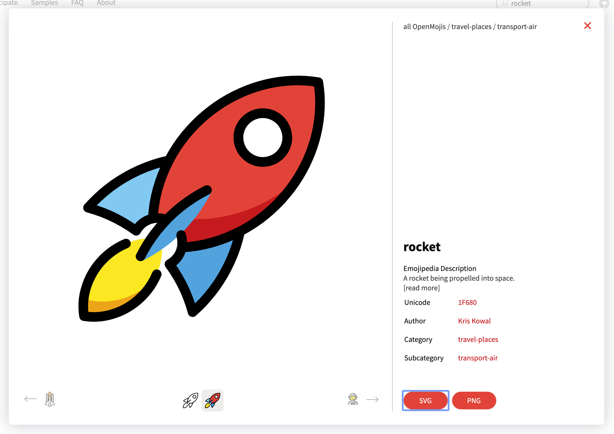
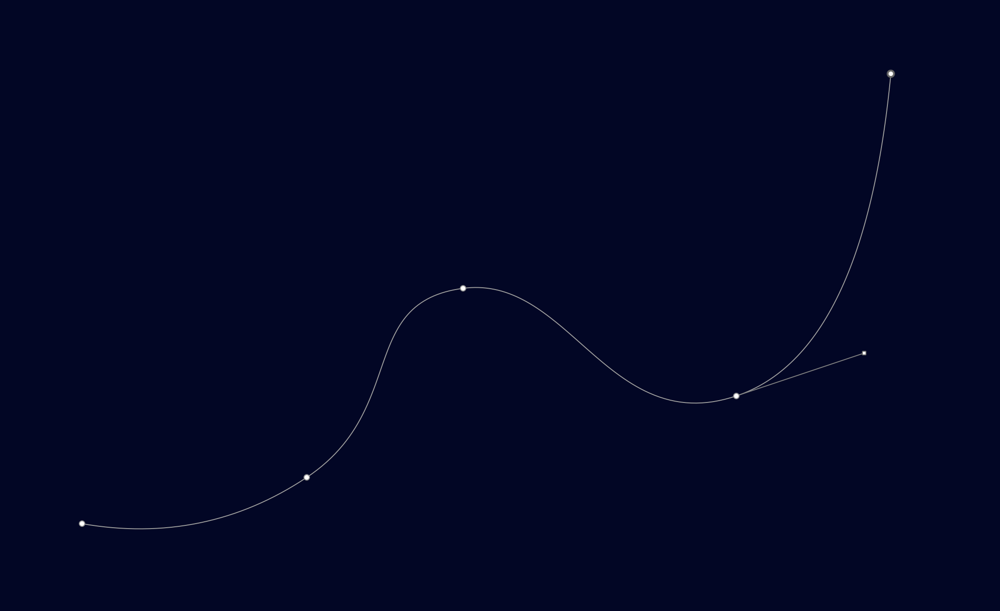

# 〰️ SVG 路径动画（Path）

## 演示


我更喜欢把这种动画叫做**路径跟随动画**或者**轨迹动画**，正如你所看到的，一个元素（物体）沿着特定的路径（轨迹）进行运动。

## 原理

### CSS 属性

如果想在 CSS 中让一个元素沿着路径运动，核心要用的的属性有两个，分别是 `offset-path` 、`offset-distance`  。

 `offset-path` 这个属性接受一个 `path` 用于指定元素的运动轨迹。

 `offset-distance` 这个属性声明了元素沿着路径运动的距离。常用 `100%` 表示路径总长度。

这和上一章节介绍的 **SVG 描边动画** 原理很类似，甚至核心用到的属性都用了相同的关键字 `offset` 

其实 `offset-path` 这个属性都前身叫做 `motion-path` ，并且所有 `motion-*` 相关都属性都改为了 `offset-*` 

<EmbedCodepen title="CSS Animating Along a Path Demo" pen="LYpQXxL" />

### SVG SMIL animation

SVG SMIL animation 中定义了更简单的方式实现路径动画，使用 `animateMotion` 元素。同样可以定义一个 `path` 指定了元素运动的轨迹。

<EmbedCodepen title="SVG Animating Along a Path Demo" pen="dyYdQYR" />

## 实战

下面我们使用 GreenSock 来实现火箭🚀沿着路径运动的路径动画，GreenSock 中使用 `MotionPathPlugin` 实现路径动画，他支持让任何 Dom、SVG、Canvas 等元素动起来

### 准备矢量文件

我们需要准备两个矢量文件：

- 火箭🚀： 需要运动的元素
- 路径：火箭的运动轨迹

火箭我们可以在 [OpenMoji](https://openmoji.org/library/#search=rocket)  或者 [icons8](https://icons8.com/icons/set/rocket) 查询获取：



路径比较简单，在 Sketch 中画一条路径，拷贝出路径代码



```html
<path d="M254.176965,724.703501 C344.518264,740.446962 426.933366,723.447117 501.422273,673.703966 C613.155634,599.08924 556.372552,480.989479 673.298424,465.529966 C790.224296,450.070453 833.25236,631.21486 973.972003,584.009185 C1067.7851,552.538735 1124.45691,434.26844 1143.98743,229.1983" id="rocket-path"></path>
```

### 注册插件

在使用 `MotionPathPlugin` 时需要先注册插件

```js
// register the plugin (just once)
gsap.registerPlugin(MotionPathPlugin);
```

### 动起来

```js
// 指定要运动都元素
gsap.to("#rocket", {
  duration: 3.3, 
  repeat: -1,
  ease: Linear.easeNone,
  motionPath:{
    path: "#rocket-path", // 沿着轨迹运动
    align: "#rocket-path",
    autoRotate: true,
    alignOrigin: [0.5, 0.5]
  }
});
```

<EmbedCodepen title="GSAP Animating Along a Path Demo" pen="KKdQrQK" :height="480" />

## 参考

- [MDN offset-path](https://developer.mozilla.org/en-US/docs/Web/CSS/offset-path)
- [css-tricks offset-path](https://css-tricks.com/almanac/properties/o/offset-path/)
- [animateMotion](https://developer.mozilla.org/en-US/docs/Web/SVG/Element/animateMotion)
- [GreenSock MotionPathPlugin](https://greensock.com/motionpath/)
