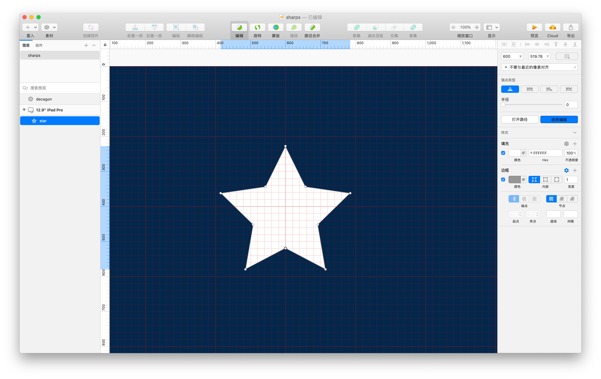
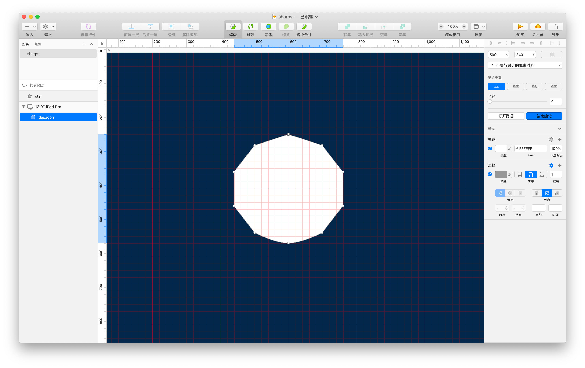
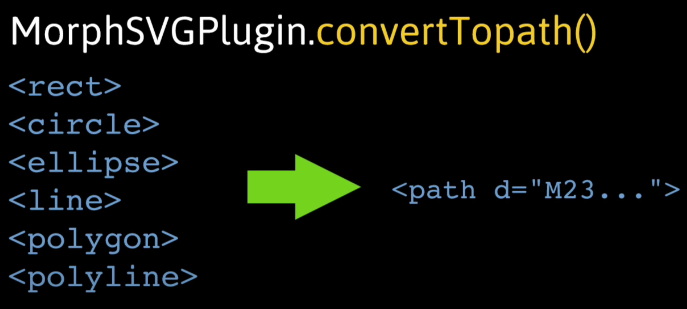

# ⭐ SVG 变形动画（Morphing）

## 演示


## 原理

平滑的变形动画真的算是 SVG 中的**独门武器**了。其原理很容易想到。就是不同形状之间能平滑转换，SVG 中的形状其实也是有不同坐标之间的线段绘制而成的。那么在转换形状的时候，只是在移动线段的坐标。从而达到了形状改变的效果，加之平滑的动画展现。达到想要的效果。

### 边数相等

::: tip
需要注意的是，如果我们在做形状转换的时候，转换前形状的**控制点**和转换后的**控制点**数不同，这时动画转换会显得差强人意。因为 SVG 形状变形的时候要么增加控制点，要么减少了控制点。而控制点的增删就不能平滑的转换了。
:::
## 实战

下面我们使用 GreenSock 编写变形动画，让一个五角星 ⭐️变化为十边形图案，GreenSock 中使用[MorphSVGPlugin](https://greensock.com/docs/v3/Plugins/MorphSVGPlugin) 进行动画的绘制。主要通过动态设置路径的 `d` 属性数据达到平滑的动画效果。

值得一提的是，如果 SVG 图形中完全是用 `path` 绘制的话，GreenSock 支持 **path → path** 转换的控制点数不同也可以完成平滑动画效果。

### 准备矢量文件

我们用 Sketch 绘制一个简单的五角星 ⭐️ 图案，看到五角星实际上有 10 个控制点



右键拷贝出 SVG path 代码

```jsx
<path d="M185,1.12977573 L128.163889,116.292316 L1.07448057,134.759488 L93.0372403,224.401023 L71.3277776,350.976903 L185,291.215879 L298.672222,350.976903 L276.96276,224.401023 L368.925519,134.759488 L241.836111,116.292316 L185,1.12977573 Z" id="star" fill="#4af"></path>
```

我们再绘制一个十边形图案



右键拷贝出 SVG  path 代码

```jsx
<path d="M160,0 L258.885438,32 L320,110.557281 L320,210.424346 L258.885438,289.442719 C217.122754,309.81424 184.160941,320 160,320 C135.839059,320 102.877246,309.81424 61.1145618,289.442719 L0,210.424346 L0,110.557281 L61.1145618,32 L160,0 Z" id="decagon" fill="transparent"></path>
```

### 动起来

**path → path**之间的变换，初始显示 `star` 路径，将 `decagon` 路径设置为 `transparent`，视觉上看不到十边形

```html
<svg width="300" height="300" viewBox="0 0 600 600">
  <!-- star path -->
  <path d="M185,1.12977573 L128.163889,116.292316 L1.07448057,134.759488 L93.0372403,224.401023 L71.3277776,350.976903 L185,291.215879 L298.672222,350.976903 L276.96276,224.401023 L368.925519,134.759488 L241.836111,116.292316 L185,1.12977573 Z" id="star" fill="#4af"></path>
  <!-- decagon path set fill transparent, you don't see the sharp -->
  <path d="M160,0 L258.885438,32 L320,110.557281 L320,210.424346 L258.885438,289.442719 C217.122754,309.81424 184.160941,320 160,320 C135.839059,320 102.877246,309.81424 61.1145618,289.442719 L0,210.424346 L0,110.557281 L61.1145618,32 L160,0 Z" id="decagon" fill="transparent"></path>
</svg>
```

```jsx
// gsap.to()... infinity and beyond!
// For more check out greensock.com
let tl = gsap.timeline({
  repeat: -1,
  yoyo: true,
  repeatDelay: 0.3,
  defaults: {
    duration: 3
  }
})

// 让星星形状转换成十边形
tl
.to("#star", { morphSVG: "#decagon" })
.timeScale(3);
```

<EmbedCodepen title="GSAP Sharp Morphing Demo1" pen="qBOMWJM" :height="360" />

### 多个变换

GreenSock 同时支持多个形状的变换，假设我们的变换规则变为：p**ath → path → rect** 

星星变换到十边形之后再变换为一个矩形。而我们知道图形点数不同的图形之间变换不会达到预期效果，好在 MorphSVGPlugin 提供了可以将基本形状变为 path 的方法



```jsx
// 将 circle 图形转换为 path
MorphSVGPlugin.convertToPath("rect");
```

结合 MorphSVGPlugin 特性可以将任何 **path → path** 平滑变换动画，所以任何基本图形之间都可以平滑转换了。

多个图形之间的变换只需通过 GSAP 中到 timeline 实例追加变换规则就可以实现：

```html
<svg width="300" height="300" viewBox="0 0 600 600">
  <!-- star path -->
  <path d="M185,1.12977573 L128.163889,116.292316 L1.07448057,134.759488 L93.0372403,224.401023 L71.3277776,350.976903 L185,291.215879 L298.672222,350.976903 L276.96276,224.401023 L368.925519,134.759488 L241.836111,116.292316 L185,1.12977573 Z" id="star" fill="#4af"></path>
  <!-- decagon path set fill transparent, you don't see the sharp -->
  <path d="M160,0 L258.885438,32 L320,110.557281 L320,210.424346 L258.885438,289.442719 C217.122754,309.81424 184.160941,320 160,320 C135.839059,320 102.877246,309.81424 61.1145618,289.442719 L0,210.424346 L0,110.557281 L61.1145618,32 L160,0 Z" id="decagon" fill="none"></path>
  <!-- rectangle sharp -->
  <rect id="rect" x="0.5" y="0.5" width="319" height="319" id="rect" fill="none"></rect>
</svg>
```

```jsx
// gsap.to()... infinity and beyond!
// For more check out greensock.com
MorphSVGPlugin.convertToPath("rect");

let tl = gsap.timeline({
  repeat: -1,
  yoyo: true,
  repeatDelay: 0.3,
  defaults: {
    duration: 3
  }
})

tl
  .to("#star", { morphSVG: "#decagon" }, "+=1")
  .to("#star", { morphSVG: "#rect" }, "+=1")
  .timeScale(3);
```

<EmbedCodepen title="GSAP Sharp Morphing Demo2" pen="NWGLPKM" :height="360" />

### 蒙版动画

利用图形变换的效果。结合 SVG 中的 `clipPath` 可以轻松实现一个带有蒙版效果的动画，其原理实际上是使用**图形**将**图片**遮照起来。

<EmbedCodepen title="GSAP Sharp Morphing Demo3" pen="wvKEBex" :height="360" />


## 参考

- [How SVG Sharp Morphing Works](https://css-tricks.com/svg-shape-morphing-works/)
- [GreenSock MorphSVGPlugin](https://greensock.com/docs/v3/Plugins/MorphSVGPlugin)