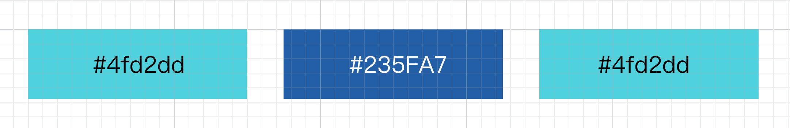
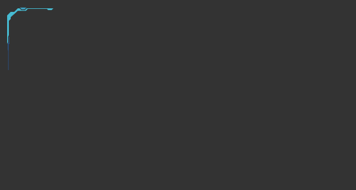
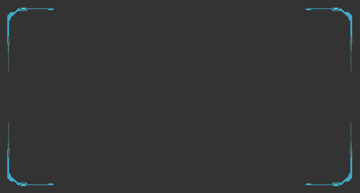

# ✨ SVG 闪烁动画（Blink）

## 演示

人类的视觉比较容易被变化所吸引，尤其是颜色的变化。像上世纪 80 年代的霓虹灯广告牌，我很难不被它所吸引。


## 原理

闪烁动画效果的核心在于控制元素颜色的变化，掌握好时间的控制，让颜色的变化有引人注目的显示，这样在静态的页面中，自然会吸引住用户的眼球。

## 实战

下面会使用三种方法编写一个闪烁动画：

### CSS 实现 Blink 动画

CSS 动画也可以实现各种类型的闪烁效果，比如让整个元素进行不断的 `显示/隐藏` 切换（通过 `display` 属性），不过最好不要这么做，这会导致浏览器进行回流，有一定的性能开销；或者通过控制颜色的透明度（`opacity` 属性），文字的闪烁效果可以通过控制颜色的变化（`color` 属性）等等。下面看一个闪烁动画实例：

<EmbedCodepen title="Text Blink" pen="oNjREQr" :height="160" />

这段动画实现了让文字过渡到透明，但是会生硬的变回原来的颜色，不过它足够**“闪烁“，**如何让颜色过渡更平滑呢**，实际上**闪烁动画搭配 `animation-direction` 属性使用效果会更好，`animation-direction` 属性如何设置为 `alternate` 或者 `alternate-reverse`（默认为 normal）时， 它的作用是会让动画增加一个循环周期，这时需要把 `animation-duration` （动画时长）减半，才能达到预期的效果。

<EmbedCodepen title="Text Smooth Blink" pen="Baoerwm" :height="160" />

### SVG 实现 Blink 动画

`SVG SMIL Animation` 同样也能实现对图形的闪烁效果，通过声明 `attributeName` 为 `fill` ，指定想要变化的颜色。设定动画时长，就会让 SVG 图形闪烁起来。核心代码：

```jsx
<polygon fill="#4fd2dd" points="6,66 6,18 12,12 18,12 24,6 27,6 30,9 36,9 39,6 84,6 81,9 75,9 73.2,7 40.8,7 37.8,10.2 24,10.2 12,21 12,24 9,27 9,51 7.8,54 7.8,63">
  <animate
    attributeName="fill"
    values="#4fd2dd;#235fa7;#4fd2dd"
    dur="0.5s"
    begin="0s"
    repeatCount="indefinite"
  />
</polygon>
```

上述代码指定了 polygon 折线会按以下颜色顺序进行颜色的无限循环变化，产生闪烁效果



<EmbedCodepen title="Blink Border" pen="XWmNYyr" :height="200" />

通过给每条折线指定一个动画设定，那么就可以让多条折线一起闪烁起来，形成一个组合动画。

### GSAP 实现闪烁动画

继续沿用上例 SVG 闪烁边框，如何使用 GSAP 让边框闪烁起来呢，例子中的边框有三条 polygon ，我们注意到三条折线是同时进行闪烁动画的，每条折线都有自己的动画设定。所以在 GSAP 中我们不能使用 timeline，动画不是线性的，而是并行的。

我们先给折线定义好 `id` 属性

```jsx
<div class="gs-border-blink">
  <svg width="300px" height="300px" class="left-top">
    <polygon id="line1" fill="#4fd2dd" points="6,66 6,18 12,12 18,12 24,6 27,6 30,9 36,9 39,6 84,6 81,9 75,9 73.2,7 40.8,7 37.8,10.2 24,10.2 12,21 12,24 9,27 9,51 7.8,54 7.8,63"> </polygon>
    <polygon id="line2" fill="#235fa7" points="27.599999999999998,4.8 38.4,4.8 35.4,7.8 30.599999999999998,7.8"></polygon>
    <polygon id="line3" fill="#4fd2dd" points="9,54 9,63 7.199999999999999,66 7.199999999999999,75 7.8,78 7.8,110 8.4,110 8.4,66 9.6,66 9.6,54"></polygon>
  </svg>
</div>
```

开始动画咯

```jsx
// line 1, #4fd2dd -> #235fa7 -> #4fd2dd
gsap
  .to('#line1', {
    fill:'#235fa7',
    repeat: -1,
    yoyo: true,
    duration: 0.25,
    repeatDelay: 0
  })
gsap
  .to('#line1', {
    fill:'#4fd2dd',
    repeat: -1,
    yoyo: true,
    duration: 0.25,
    repeatDelay: 0.25
  });

// line 2, #235fa7 -> #4fd2dd
gsap
  .to('#line2', {
    fill:'#4fd2dd',
    repeat: -1,
    yoyo: true,
    duration: 0.3,
    repeatDelay: 0
  })
  
// line 3, #4fd2dd -> transparent -> #235fa7
gsap
  .to('#line3', {
    fill:'transparent',
    repeat: -1,
    yoyo: true,
    duration: 0.5,
    repeatDelay: 0
  })
gsap
  .to('#line3', {
    fill:'#235fa7',
    repeat: -1,
    yoyo: true,
    duration: 0.5,
    repeatDelay: 0.3
  });
```

### 复用 SVG 图形、动画

想象一下，我们有了一个位于左上角的边框动画，只需通过 CSS 控制让整个形状翻转，就会得到右上角、左下角、右下角的边框，四组边框就会构成一个大的边框动画。



左上角边框



完整边框

但是我们的 SVG 代码需要有四个组，实际上四个组的形状和动画是完全相同的。那有什么好的方法可以复用一组代码呢，还好，SVG 提供了 `defs` 以及 `use` 标签用于解决这样的问题。

MDN 上的 SVG defs 解释是这样的：

> The <defs> element is used to store graphical objects that will be used at a later time. Objects created inside a <defs> element are not rendered directly. To display them you have to reference them (with a <use> element for example).

复用 SVG 图形：

1、首先给 SVG 图形分组为 `blink-border` ，并且包裹在 `defs` 标签下

```jsx
<div class="gs-border-blink">
  <svg viewBox="0 0 320 180">
    <defs>
      <g id="blink-border">
        ... polygons
      </g>
    </defs>
  </svg>
</div>
```

2、使用 `use` 标签引用声明好的图形，定义好 class

```jsx
<svg class="left-top">
  <use xlink:href="#blink-border" />
</svg>
<svg class="right-top">
  <use xlink:href="#blink-border" />
</svg>
<svg class="left-bottom">
  <use xlink:href="#blink-border" />
</svg>
<svg class="right-bottom">
  <use xlink:href="#blink-border" />
</svg>
```

3、编写翻转样式

```css
.gs-border-blink {
  position: relative;
}

.left-top {
  position: absolute;
  top: 0;
  left: 0;
}

.right-top {
  position: absolute;
  top: 0;
  right: 0;
  transform: rotateY(180deg);
}

.left-bottom {
  position: absolute;
  bottom: 0;
  left: 0;
  transform: rotateX(180deg);
}

.right-bottom {
  position: absolute;
  right: 0;
  bottom: 0;
  transform: rotateX(180deg) rotateY(180deg);
}
```

这样一个可缩放、响应式的闪烁边框动画就完成了。

<EmbedCodepen title="GSAP Blink Border" pen="oNjZLoB" :height="480" />

总结一下：编写闪烁动画并不难，我们有多个方法可以使用。但是每种方法核心使用到的属性其实概念都差不多，看一下三种方法的对比：

[闪烁动画属性对比](https://www.notion.so/f79c51c988cd4195a3074407c9052f17)

## 参考

- [https://developer.mozilla.org/en-US/docs/Web/CSS/animation](https://developer.mozilla.org/en-US/docs/Web/CSS/animation)
- [https://developer.mozilla.org/en-US/docs/Web/SVG/SVG_animation_with_SMIL](https://developer.mozilla.org/en-US/docs/Web/SVG/SVG_animation_with_SMIL)
- [https://developer.mozilla.org/en-US/docs/Web/SVG/Element/defs](https://developer.mozilla.org/en-US/docs/Web/SVG/Element/defs)