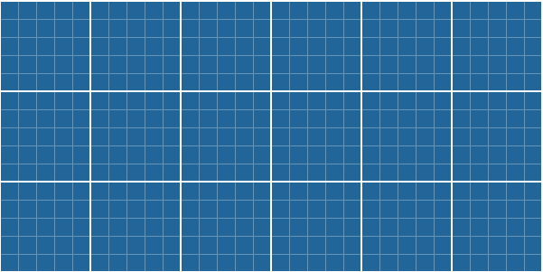
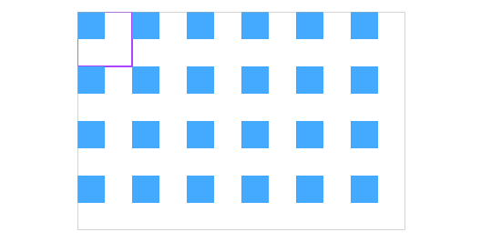
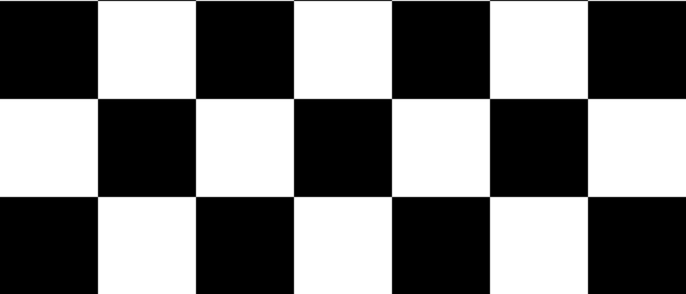

# 🖼️ SVG 图案动画（Pattern）

想要在Web页面中绘制背景图案，我们首先可能想到的是使用 CSS，可能你也有所尝试，比如简单的渐变到复杂的网格、点阵等，SVG 中也有绘制背景图案的解决方案。

SVG 中 `fill` 属性支持以 `pattern` 方式填充一个图案，Pattern 也是一个强大的元素声明，如果图案设计的比较完美，那么会轻易得到一个无缝衔接的图案。像这样：



## 原理

在 Web 页面开发中如果想使用 SVG 生成背景，实际上有两种使用方法：

### SVG Pattern

一个纯 SVG Pattern 使用的过程大致如下：

1. 在 SVG 中声明一个 `pattern` 元素
2. `pattern` 中要声明我们想要绘制的图形
3. 创建一个新的图形，使用 SVG 中的 `fill` 属性，填充图案

代码例子：

```html
<svg width="360" height="240">
  <!-- defined a pattern for canvas -->
  <defs>
    <pattern id="rect" patternUnits="userSpaceOnUse" width="60" height="60">
      <rect width="30" height="30" fill="#4af" :x="range" :y="range"></rect>
    </pattern>
  </defs>
  <!-- simulate the pattern area -->
  <rect width="60" height="60" stroke="#a4f" stroke-width="2" fill="none" />
  <!-- fill pattern into canvas -->
  <rect id="canvas" width="360" height="240" stroke="#aaa" fill="url(#rect)" />
</svg>
```

上面代码会得到如下图形，蓝色方块就是我们声明的 `pattern` （图案），图案区域大小为 60 * 60 （单位 px），下图以紫色边框模拟一个图案的大小范围，图案就会以这样重复填满整个 360 * 240 的图形区域，形成一个大的图案。



<EmbedCodepen title="SVG Pattern 1" pen="qBbbaJM" :height="360" />

### SVG as background-image

这种方法其实是结合 CSS 使用 SVG ，过程如下：

1. 创建好一个 SVG 图形，无需声明 `pattern` 元素
2. 使用 `background-image` 引入 Base64 转码过的 Data-URI

代码看起来像这样：

```css
.bg {
  background-image: url("data:image/svg+xml;%3csvg.../svg%3E");
}
```

以上面例子为基础，编写一个 SVG as background-image 版本：

<EmbedCodepen title="SVG Pattern 2" pen="dyGGvWK" :height="360" />

这里 SVG 转 Data-URI 使用这个工具：[URL-encoder for SVG](https://yoksel.github.io/url-encoder/)

## 实战

在 《CSS 揭秘》这本书中介绍复杂的背景图案（网格）时，作者展示了仅用4行代码，即可生成一幅简单的[网格图案](https://leaverou.github.io/css3patterns/#blueprint-grid)，也就是本篇文章的题图，如果要使用 SVG 绘制相同的图案的话，代码行数未见得会比纯 CSS 少。我们来做下对比：

### 网格图案 CSS 版

```html
<div class="grid-pattern"></div>
```

```css
body {
  margin: 0;
}

.grid-pattern {
  height: 100vh;
  width: 100vw;
  border: 1px solid #fff;
  background-color: #269;
  background-image: linear-gradient(white 2px, transparent 2px),
    linear-gradient(90deg, white 2px, transparent 2px),
    linear-gradient(rgba(255,255,255,.3) 1px, transparent 1px),
    linear-gradient(90deg, rgba(255,255,255,.3) 1px, transparent 1px);
  background-size: 100px 100px, 100px 100px, 20px 20px, 20px 20px;
  background-position: -2px -2px, -2px -2px, -1px -1px, -1px -1px;
}
```

书中作者使用的是巧妙的渐变 + 位置控制实现网格效果。

<EmbedCodepen title="CSS Grid Pattern" pen="QWyydwB" :height="360" />

### 网格图案 SVG Pattern 版

```html
<svg width="100%" height="100%">
  <defs>
    <pattern id="rect" patternUnits="userSpaceOnUse" width="100" height="100">
			<!-- defined the shape -->
      <rect width='100' height='100' fill='#269'/>
      <g fill='#6494b7'>
        <rect width='100' height='1' y='20'/>
        <rect width='100' height='1' y='40'/>
        <rect width='100' height='1' y='60'/>
        <rect width='100' height='1' y='80'/>
        <rect width='1' height='100' x='20'/>
        <rect width='1' height='100' x='40'/>
        <rect width='1' height='100' x='60'/>
        <rect width='1' height='100' x='80'/>
      </g>
      <rect width='100' height='100' fill='none' stroke-width='2' stroke='#fff'/>
    </pattern>
  </defs>
  <rect id="canvas" width="100%" height="100%" fill="url(#rect)" />
</svg>
```

我们这里使用 SVG Pattern 实现上面一样的网格，实现思路就完全不同了。需要绘制多个基本图形矩形。来达到目的。但是生成整个图案的核心思想还没有变，先构建一个可复制的最小形状，然后让它重复填充满整个区域。

<EmbedCodepen title="SVG Grid Pattern" pen="LYGGxJy" :height="360" />

本章我们介绍过，SVG 有两种实现图案的方式，另一种 SVG as Background Image 的方式就由你来进行实验。这里不进行介绍了。

既然使用 CSS 创建的背景更简单，那么我们为什么还要使用 SVG 呢，其实是因为 SVG 创建的图形是矢量的。可控性更强，尤其是要写动画时。我们可以基于 SVG 图案实现一些复杂的动画效果。

## 动态的背景图案

假设我们让一个黑白格的类似棋盘的背景图案动起来



这个动画很简单，结合背景色的变化，让矩形元素 scale 到很小，再弹回来。小心看久了被催眠，眼晕。😂

其实在制作背景图案动画时，我只需考虑如何让 SVG Pattern 元素内的图形动起来即可。至于剩余的都是重复了一个 `pattern` 的动效模式，制造出一个庞大的整体动效。

<EmbedCodepen title="GSAP SVG Pattern Animation" pen="WNrrpqG" :height="360" />

## 优秀的 SVG Pattern 类库

- [Hero Pattern](http://www.heropatterns.com/)
- [Trianglify.io](http://trianglify.io/)
- [http://btmills.github.io/geopattern/](http://btmills.github.io/geopattern/)

## 参考

- [https://developer.mozilla.org/en-US/docs/Web/SVG/Tutorial/Patterns](https://developer.mozilla.org/en-US/docs/Web/SVG/Tutorial/Patterns)
- [https://css-tricks.com/snippets/svg/svg-patterns/](https://css-tricks.com/snippets/svg/svg-patterns/)
